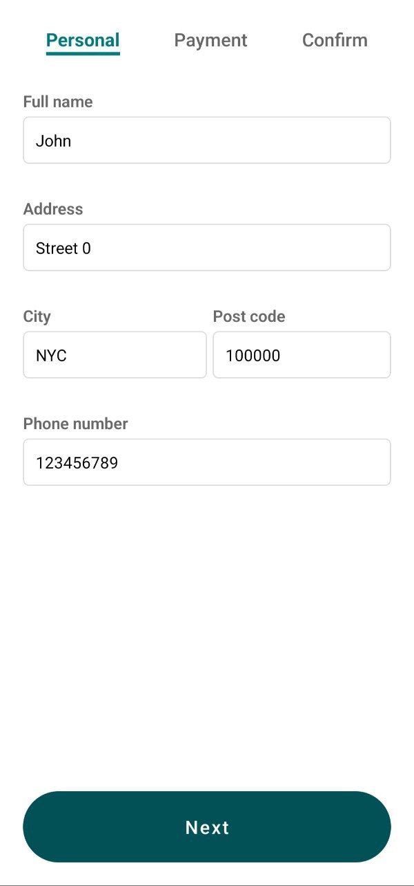
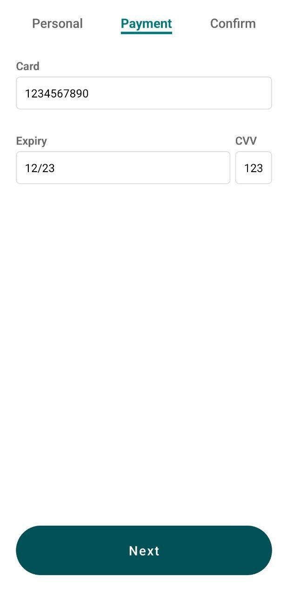
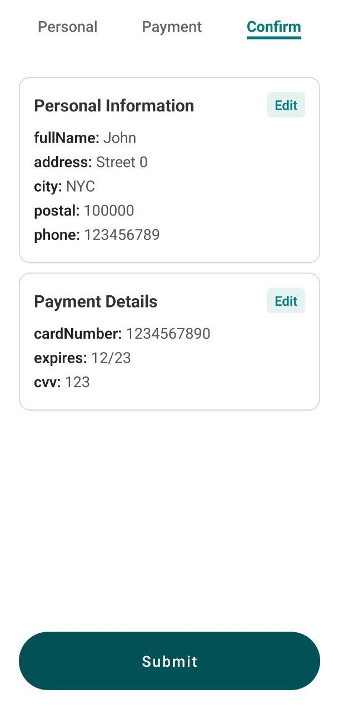

# Multi-Step Form

A responsive multi-step form implementation built with React Native.

## Overview

This project provides a user-friendly multi-step form that guides users through a sequential input process. The form is designed to be intuitive, responsive across different device sizes, and provides validation at each step.

## Screenshots

<div style="display: flex; flex-direction: row; justify-content: space-between; flex-wrap: wrap;">
  
  
  
</div>

## Features

- Input validation with Zod for each step
- React Hook Form for form management
- Progress indicator
- Zustand for global State management
- Final summary review before submission

## Installation

```bash
# Clone the repository
git clone

# Navigate to the project directory
cd multi-step-form

# Install dependencies
npm install

# Start the development server
npm start
```
